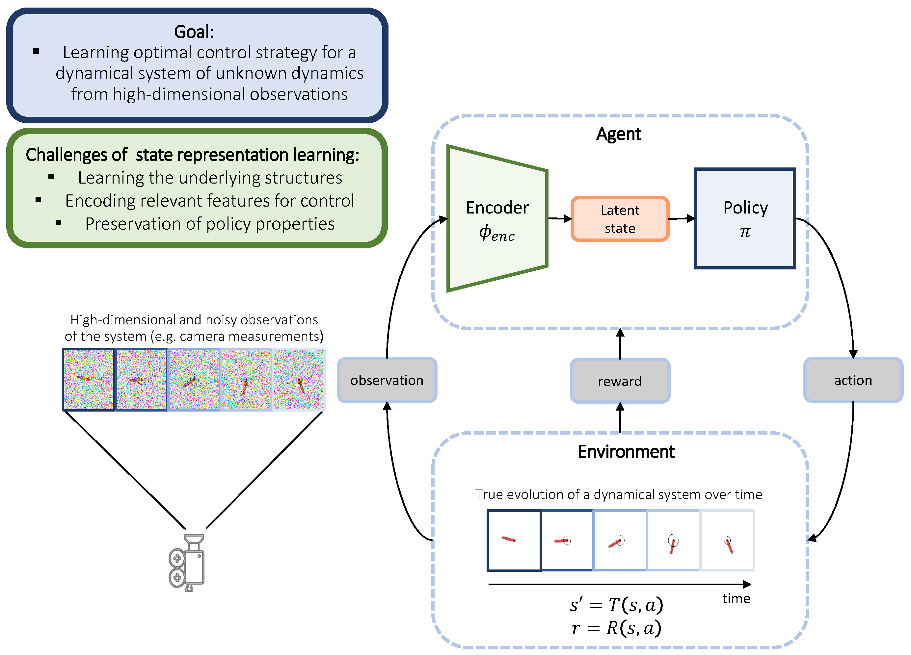

# Unsupervised Representation Learning in Deep Reinforcement Learning: A Review

Code accompanying the paper:

**Unsupervised Representation Learning in Deep Reinforcement Learning: A Review**\
Nicolò Botteghi, Mannes Poel, Christoph Brune,
The can be found at: [Link](https://arxiv.org/pdf/2208.14226.pdf).



**Abstract:** 
This review addresses the problem of learning abstract representations of the measurement data in the context of Deep Reinforcement Learning (DRL). While the data are often ambiguous, high-dimensional, and complex to interpret, many dynamical systems can be effectively described by a low-dimensional set of state variables. Discovering these state variables from the data is a crucial aspect for improving the data efficiency, robustness and generalization of DRL methods, tackling the \textit{curse of dimensionality}, and bringing interpretability and insights into black-box DRL. This review provides a comprehensive and complete overview of unsupervised representation learning in DRL by describing the main Deep Learning tools used for learning representations of the world, providing a systematic view of the method and principles, summarizing applications, benchmarks and evaluation strategies, and discussing open challenges and future directions.

## Requirements

* python 3.8
* pytorch (version 1.12 + CUDA 11.6)
* matplotlib
* sklearn

## Implemented Models
We implemented the most relevant state representation learning methods discussed in the review and several combinations of them. Below the complete list:
* linear autoencoder (linearAE)
* autoencoder (AE) 
* variational autoencoder (VAE)
* deterministic latent forward model (detFW)
* deterministic latent forward model with contrastive hinge loss (detFW+CL)
* stochastic latent forward model (stochFW)
* stochastic latent forward model with contrastive hinge loss (stochFW+CL)
* latent reward model (detRW)
* latent inverse model (detIN) for continuous action spaces
* deterministic encoder trained with robotics priors fro continuous action spaces (encPriors)
* action-equivariance MDP homomorphism (detMDPH)
* deep bisimulation metric (encBisim)
* autoencoder with deterministic latent forward model (AEdetFW)
* autoencoder with latent reward model (AEdetRW)
* autoencoder with latent inverse model (AEdetIN)
* deterministic latent forward, and reward model (FWRW)
* deterministic latent forward, reward, and inverse model (FWRWIN)
* deterministic encoder trained with hinge loss (encCL)

## Test Case
Learning pendulum state representation from:
* RGB images (84x84x6)
* RGB images with static distractor in each observation (background)
* RGB images with dynamics distractor (the distractor randomly changes position in each observation)

We provide the training and testing dataset used to generate the results presented in the paper (dowload here [Link] and place in folder 'data')(https://surfdrive.surf.nl/files/index.php/s/P0FUd74HSZN9Wcs). The datasets were collected by applying a random policy to the Pendulum-v1 from Gym ([Link](https://www.gymlibrary.dev/environments/classic_control/pendulum/))

### Train the model
```bash
python main.py 
```

## Cite
If you use this code in your own work, please cite our papers:
```
@article{botteghi2022unsupervised,
  title={Unsupervised Representation Learning in Deep Reinforcement Learning: A Review},
  author={Botteghi, Nicol{\`o} and Poel, Mannes and Brune, Christoph},
  journal={arXiv preprint arXiv:2208.14226},
  year={2022}
}

```